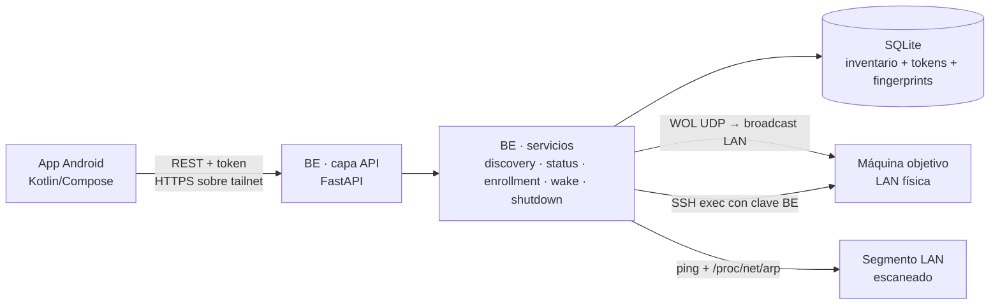
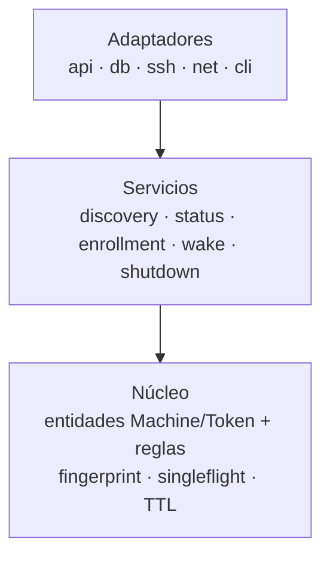

# Architecture Spine — wakemeupManager

## Design Paradigm
Backend **hexagonal**: núcleo de servicios y entidades (sin IO), rodeado de adaptadores (`api`, `db`, `ssh`, `net`, `cli`). La app Android sigue **MVVM + UDF** (ViewModel + StateFlow + `collectAsStateWithLifecycle`). El único contrato entre las dos unidades es la **API REST** (FR-9): la app depende del contrato, nunca del BE; el BE no conoce la app.

Contexto de sistema:



Capas internas del BE (dependencias solo hacia abajo):



## Invariants & Rules

### AD-1 — La API REST es el único contrato entre BE y app

- **Binds:** FR-9, FR-10, FR-11, FR-12..FR-15; `all` en el límite de unidades
- **Prevents:** acoplamiento implícito (formatos propios, endpoints privados, lógica de negocio filtrada al cliente)
- **Rule:** Toda interacción app→BE pasa por endpoints del catálogo FR-9 con cuerpo JSON del vocabulario del Glosario y errores del catálogo FR-9. La app no lee SQLite ni comparte código con el BE. Superficie fijada (rutas verbatim, prefijo `/api/v1`):
  - `GET /api/v1/status` — estado/versión del BE, interfaz emisora WOL, healthcheck
  - `GET /api/v1/machines` — listado con estado y estatus gestionada/descubierta
  - `POST /api/v1/scan` — fuerza escaneo; 202 + stats
  - `POST /api/v1/machines/{id}/enroll` — alta (body: usuario, password)
  - `POST /api/v1/machines/{id}/wake` — encendido
  - `POST /api/v1/machines/{id}/shutdown` — apagado
  - `DELETE /api/v1/machines/{id}` — borrado (uso avanzado, vía API/CLI)
  - `GET /api/v1/events` — stream SSE de cambios de estado (AD-11), auth Bearer
  - `GET /api/v1/mcp` — endpoint del servidor MCP montado en FastAPI (AD-12), auth token MCP
  - Errores según catálogo FR-9, cuerpo `{"error": {"code", "message"}}`

### AD-2 — Identidad de máquina: id interno + fingerprint de host; la IP es efímera

- **Binds:** FR-1, FR-2, FR-6, FR-7; entidad `Machine`
- **Prevents:** apagar/instalar claves sobre la máquina equivocada tras reasignación DHCP (hallazgo adversarial)
- **Rule:** `Machine` = id entero (PK) + `host_fingerprint` fijado en el alta + `remote_user` (usuario remoto del alta). La IP es un atributo de estado, no de identidad: el WOL usa la MAC registrada; el SSH de shutdown solo se ejecuta si el fingerprint actual coincide con el fijado; si no coincide, la máquina pasa a `no_fiable` y no se actúa sobre ella. Formato de fingerprint: `SHA256:<base64>` de la clave de host servida en el alta (TOFU en el primer contacto, fijada a partir de entonces).

### AD-3 — Descubrimiento y estado: serializado, no destructivo, autoexcluyente

- **Binds:** FR-1, FR-2, FR-3, FR-12
- **Prevents:** carreras entre escaneo periódico y forzado; pérdida de inventario; auto-gestión del propio BE
- **Rule:** Un único escaneo a la vez (singleflight). Escaneo periódico cada 10 min (configurable) + `POST /scan` forzado; ambos serializados sobre el mismo lock. Contrato `/scan`: si ya hay un escaneo en curso, el BE responde **202 con estadísticas del escaneo en marcha** (nunca 409); la app refresca el listado tras recibir el 202 (polling natural). Resultado: upsert de IP/MAC/hostname; ausencias → `offline`, nunca borrado (solo `DELETE` explícito — borrado no disponible en la UI de v1). Se excluyen las interfaces del BE (incluida tailnet/loopback) y direcciones no-LAN. Estado: TTL 60 s (15–300 s), comprobación TTL/2.

### AD-4 — Acciones wake/shutdown solo a través de servicios, con verificación previa

- **Binds:** FR-4, FR-5, FR-7, FR-13
- **Prevents:** comandos arbitrarios por SSH; WOL sobre interfaz equivocada; apagado sin validar identidad
- **Rule:** `wake` y `shutdown` se implementan en servicios dedicados; los adaptadores `net`/`ssh` no los exponen al API directa. Wake: UDP al broadcast de la subred física, por interfaz Ethernet si existe (FR-5) — si no hay interfaz Ethernet, el BE no bloquea pero `GET /status` reporta `status: warning` (WOL no fiable vía WiFi); paquete sobre MAC validada (422 si inválida); un envío por petición. Shutdown: verifica fingerprint (AD-2) antes de ejecutar el comando; comando fijo configurado en `[shutdown] command` de la config (default `sudo -n systemctl poweroff`, mismo prefijo que documenta el flujo de alta para `sudoers NOPASSWD`), sin shell libre; se documenta el prerequisito de `sudoers NOPASSWD` restringido al comando.

### AD-5 — Alta: password de un solo uso, sin subprocesos, authorized_keys idempotente

- **Binds:** FR-6, FR-14
- **Prevents:** credencial en argv/entorno visible por `ps`/`/proc`; claves duplicadas o borrado accidental
- **Rule:** El alta se hace con `asyncssh` en proceso (sin `sshpass`), lo que **sustituye el mecanismo de fichero temporal chmod 600 descrito en FR-6** (se sincroniza el PRD): conexión con password (una sola vez, en memoria del proceso BE, nunca persistida ni logueada), captura y fijación del fingerprint (AD-2, AD-9), y copia de la clave vía SFTP: si la clave pública del BE no está en `~/.ssh/authorized_keys` del usuario remoto, se añade (append idempotente). Password fallida o éxito → no se conserva ningún rastro; fallo → error del catálogo y la máquina permanece descubierta.

### AD-6 — API: solo tailnet+loopback, tokens por dispositivo hasheados, rate-limit

- **Binds:** FR-9, FR-10, FR-11
- **Prevents:** exposición a la LAN física (token en claro esnifable); token plano en base de datos; fuerza bruta
- **Rule:** El servidor escucha solo en la interfaz de la tailnet y loopback (FR-9). Tokens: 32 B aleatorios, mostrados una sola vez en la CLI de alta. Pre-imagen canónica del hash: la cadena hex en minúsculas de los 32 B; se almacena `SHA256(hex-lower)` en SQLite (la CLI, la API y el CLI de revocación hashean la misma representación). Revocables individualmente. Fallos de autenticación: 5 en 5 min → HTTP 429 durante 15 min (backoff); los contadores 429 viven en memoria del proceso (se resetean al reiniciar — aceptado en v1, documentado). Logs sin datos de credenciales (FR-11).

### AD-7 — Persistencia: SQLite como único almacenamiento operacional

- **Binds:** FR-1, FR-3, FR-6, FR-8, FR-10
- **Prevents:** inventario en fichero plano inconsistente; claves fuera de control de permisos
- **Rule:** Inventario, tokens (hash), fingerprints y registro de actividad viven en SQLite (`aiosqlite`). La clave privada SSH del BE y el fichero de configuración quedan **fuera** de SQLite: directorio con permisos 600 (o 700 en el directorio), propiedad del usuario dedicado del servicio. Backups de v1: copia simple del fichero SQLite (manual o cron), documentada; no se hacen backups de la clave privada.

### AD-8 — App: UDF + polling controlado + token en Keystore, estados conforme EXPERIENCE.md

- **Binds:** FR-12, FR-13, FR-14, FR-15; spines UX
- **Prevents:** derivas de UX (acciones inline, popup de apagado, estados punto+texto) y token en SharedPreferences
- **Rule:** UI sin lógica de negocio: ViewModel + StateFlow, estado único por pantalla, `collectAsStateWithLifecycle`. Polling 30 s por defecto (10–300 s, pausable con ahorro de batería), pull-to-refresh, "escanear ahora". Todo apagado pasa por el diálogo de confirmación (EXPERIENCE.md · Flow 3). Token en Keystore Android (Encrypted DataStore; EncryptedSharedPreferences queda excluida por deprecación). Strings ES/EN externas desde v1. Estado por fila: `descubierta` (solo Alta), `gestionada/online` (Apagar), `gestionada/offline` (Encender), `no_fiable` (badge ámbar, sin acciones destructivas) — los estados van en el wire model del DTO (AD-10: `status: "online"|"offline"|"no_fiable"`, `managed: bool`). El borrado de máquina no existe en la UI de v1 (EXPERIENCE.md banea swipe-to-delete; el `DELETE` es uso avanzado vía API/CLI — AD-1). La app consume el stream de eventos (AD-11) y el polling queda como fallback (FR-12, FR-18).


### AD-9 — Identidad SSH del BE: clave + usuario remoto + fingerprint fijados juntos

- **Binds:** FR-6, FR-7, FR-8; servicios `enrollment` y `shutdown`
- **Prevents:** enrollment y shutdown construidos con identidades distintas (usuario remoto, ruta de clave, algoritmo, formato de fingerprint) que harían fallar todo apagado o marcarían todo `no_fiable`
- **Rule:** El par de claves del BE se genera en el despliegue (Ed25519, `~wakemeup/.ssh/id_ed25519`, 600) y es el único par que usa el servicio (FR-8). El alta fija en la `Machine`: `remote_user`, `host_fingerprint` (`SHA256:<base64>`, AD-2) y el comando configurado de apagado queda en config, no por máquina. Cualquier conexión de shutdown usa exactamente `remote_user` + par del BE + fingerprint fijado.

### AD-10 — El DTO de máquina lleva el estado completo en el wire

- **Binds:** FR-9, FR-12, FR-13; app `data/remote`
- **Prevents:** la app mostrando "Apagar" en filas que el BE rechaza por `no_fiable` (apagados fallidos en bucle)
- **Rule:** El contrato de `GET /machines` y del listado incluye por máquina: `id`, `name`, `ip`, `mac`, `hostname`, `status ∈ {online, offline, no_fiable}`, `managed ∈ {true, false}`. La UI degrada filas `no_fiable` a solo información + badge (EXPERIENCE.md), sin acciones destructivas. La app nunca deduce `no_fiable`: llega en el DTO.

### AD-11 — Eventos de estado: bus interno + stream SSE sobre tailnet; polling como fallback

- **Binds:** FR-12, FR-18
- **Prevents:** dos fuentes de verdad de estado (MCP, API, escaneo) sin propagar cambios; UI stale tras acciones de terceros o del agente
- **Rule:** Todo cambio de estado (online/offline/no_fiable, alta completada, escaneo terminado) entra en un bus interno del BE (asyncio pub/sub) que: (a) persiste en el registro (FR-11), y (b) emite un evento SSE serializado en JSON (tipo, máquina, timestamp) a los suscriptores conectados. El stream SSE vive en `/api/v1/events` (AD-1), autenticado con el token de dispositivo en el header de la solicitud (Bearer), sobre la interfaz solo-tailnet (AD-6). La app usa el plugin SSE de Ktor (`ktor-client-core`); reconecta con backoff exponencial y mantiene el polling 30 s (FR-12) como fallback: si el stream cae o la app entra en ahorro de batería, el polling cubre el hueco. El evento nunca transporta credenciales ni claves (FR-11).

### AD-12 — Contrato MCP: SDK oficial montado en FastAPI, token dedicado, sin tools de alta

- **Binds:** FR-10b, FR-16, FR-17; servicios de control reutilizados
- **Prevents:** dos implementaciones del contrato MCP divergentes; agente con acceso de alta (passwords SSH); servidor expuesto fuera de la tailnet
- **Rule:** El servidor MCP usa el SDK oficial `mcp` (PyPI, `mcp.streamable_http_app()` montado sobre la app FastAPI del BE), de modo que los tools del MCP llaman a los mismos servicios que la API (nunca implementación propia paralela). Auth: el token de MCP (FR-10b, hash como los de dispositivo — AD-6) se valida en la capa FastAPI antes de montar el MCP; el MCP solo escucha en la interfaz de la tailnet + loopback. Tools de v1 (FR-16): `list_machines`, `get_machine_status`, `wake_machine`, `shutdown_machine`, `force_scan`; **no** se expone ninguna tool de alta ni de gestión de claves. Las tools de control reutilizan AD-2/AD-4 (fingerprint, MAC válida, comando restringido) y sus efectos emiten eventos del bus (AD-11).

## Consistency Conventions

| Concern | Convention |
| --- | --- |
| Naming | BE: `snake_case`, paquetes `src/wakemeup/{api,services,adapters,core,cli}`; API: rutas `kebab-case` plural (`/machines`, `/scan`, `/status`). App: `camelCase`, paquetes por feature (`data/remote`, `data/local`, `domain`, `ui/`) |
| IDs & datos | Fechas ISO-8601 UTC; `Machine.id` entero PK autoincremental; token 32 B hex mostrado una sola vez |
| Errores | Catálogo FR-9 (400/401/404/409/422/429/5xx); cuerpo uniforme `{"error": {"code": string, "message": string}}` |
| Logging | journald (sistema) / Logcat (app); campos `timestamp, token_id, machine_id, action, result`; nunca passwords ni contenido de authorized_keys |
| Config | `config.toml` + override por env; secciones `[scan] [api] [ssh] [auth]` |
| Mutación de estado | Transiciones `descubierta ↔ gestionada`, `online/offline/no_fiable`; toda mutación pasa por servicios (AD-1, AD-3, AD-4) |

## Stack

*SEED — verificado contra web en 2026-09-13; el código lo posee una vez exista.*

| Name | Version |
| --- | --- |
| Python | 3.14.x (vía `uv`, no el Python de sistema) |
| uv (gestión de dependencias) | actual estable en install |
| FastAPI + uvicorn | 0.141.x |
| aiosqlite | 0.22.x |
| asyncssh | 2.24.x |
| mcp (SDK oficial Model Context Protocol, `mcp.streamable_http_app()` montado en FastAPI) | 2.2.x |
| Escaneo: binario `ping` del distro + `/proc/net/arp` | (sin paquetes extra; `ping` estándar de Raspberry Pi OS) |
| Raspberry Pi OS | Bookworm, arm64 |
| Kotlin | 2.4.20 |
| Jetpack Compose / Material 3 | BOM 2026.09.00 (M3 1.4.0; Compose UI 1.12.1 resuelto por el BOM) |
| AGP / Gradle | 9.4.x / 9.7.x |
| targetSdk / minSdk | 36 / 26 *[ASSUMPTION: minSdk 26 cubre la base instalada; Dynamic Color solo en Android 12+ y degrada al tema grafito]* |
| Ktor client (REST + SSE) + kotlinx.serialization | 3.5.2 (SSE incluido en `ktor-client-core`) |
| security-crypto / DataStore | 1.1.0 / 1.2.1 |

## Structural Seed

*SEED — scaffold de cold-start, no un inventario a mantener.*

```text
wakemeupManager/
  backend/
    pyproject.toml            # uv
    src/wakemeup/
      api/                    # rutas FastAPI (machines, scan, status, enrollment)
      services/               # discovery · status · enrollment · wake · shutdown
      adapters/               # db (aiosqlite) · ssh (asyncssh) · net (ping/arp/WOL)
      core/                   # entidades Machine, Token + reglas
      cli/                    # alta de tokens, configuración inicial
    config/config.toml.example
    deploy/wakemeup.service   # systemd
  android/
    app/
      data/remote/            # cliente Ktor + DTOs del contrato
      data/local/             # token (Keystore+DataStore), caché de listado
      domain/                 # modelos y reglas de presentación
      ui/                     # lista · alta · ajustes (Compose)
      res/values/ + res/values-en/    # strings ES/EN
```

**Entorno operacional:** despliegue = unidad `systemd` de sistema (`Wants=network-online.target`, `Restart=always`, `RestartSec=5`), usuario dedicado `wakemeup`, directorios: `/etc/wakemeup/config.toml`, `/var/lib/wakemeup/` (SQLite + claves con 600/700). Logs a journald. `GET /status` hace de healthcheck (HTTP 200 = vivo). Instalación/upgrade: script idempotente que genera el par de claves (si no existe), escribe config desde ejemplo y copia la unidad systemd; `systemctl daemon-reload && enable --now`. El servicio usa el Python gestionado por `uv` (ruta explícita en la unidad; no depende del Python de sistema de Bookworm 3.11). Dev/prod: un solo entorno (Raspberry); local dev con `uv run uvicorn` escuchando solo en loopback. *[ASSUMPTION: systemd system (no user) y usuario dedicado `wakemeup`; backups v1 = copia manual/cron de `wakemeup.db`.]*

## Capability → Architecture Map

| Capability / Área | Lives in | Governed by |
| --- | --- | --- |
| Descubrimiento y estado (FR-1..FR-3, FR-12) | `services/discovery`, `services/status`, `adapters/net` | AD-2, AD-3 |
| Wake (FR-4, FR-5) | `services/wake`, `adapters/net` | AD-4 |
| Alta y shutdown (FR-6..FR-8) | `services/enrollment`, `services/shutdown`, `adapters/ssh` | AD-2, AD-4, AD-5 |
| API, auth, logs (FR-9..FR-11) | `api/*`, `adapters/db` | AD-1, AD-6, AD-7 |
| MCP y eventos push (FR-16..FR-18) | `api/mcp*`, `api/events`, `adapters/db` | AD-11, AD-12 |
| App: lista, alta, ajustes (FR-12..FR-15) | `android/app` (data/domain/ui) | AD-8, AD-11, UX spines |

## Deferred

- **Múltiples rangos / varias LANs** — requiere re-diseño del escaneo (cross-subnet es L2); v2.
- **Windows/macOS (apagado multi-SO)** — comando y prerequisitos distintos; v2.
- **Schedules de despertado** — capa nueva de scheduler; v2.
- **Web de administración** — reusa la API, sin decisiones nuevas; v2.
- **TLS/HTTPS en la API** — innecesario mientras el canal sea tailnet cifrado; se reabre si la API se expone por otra vía.
- **Roles/permisos por usuario** — el modelo de tokens por dispositivo no impide añadirlos después; v2.
- **Rotación automática de la clave SSH del BE y de tokens vencidos** — proceso manual documentado en v1.
- **Alertas/notificaciones push** — fuera del alcance de v1 (UX lo banea).
- **Backup avanzado (automático, cifrado de claves)** — v2; v1 = copia simple documentada.
